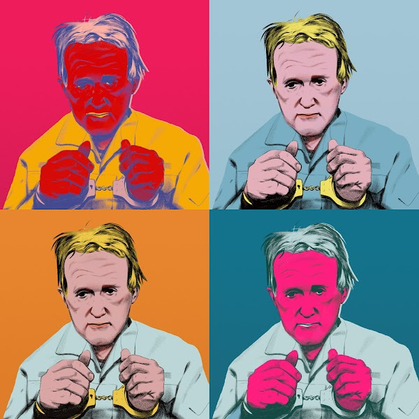
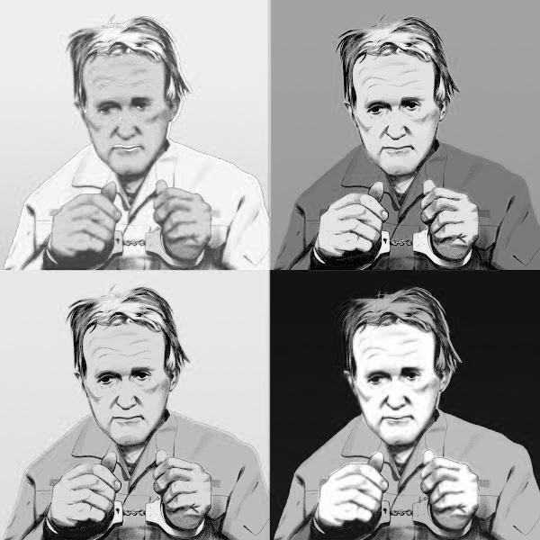
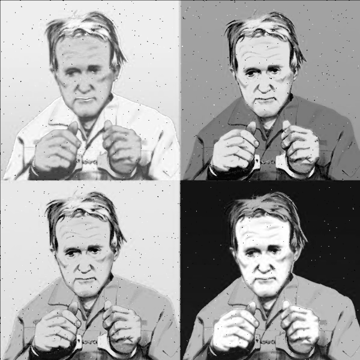
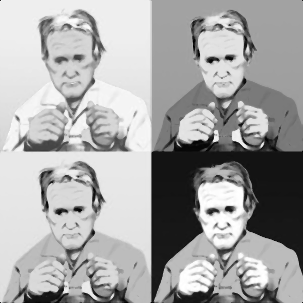
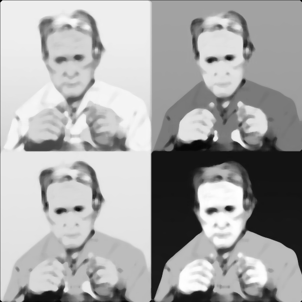
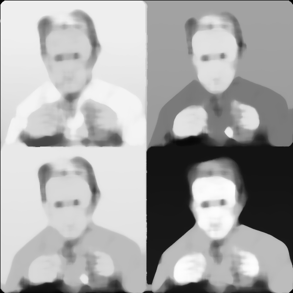
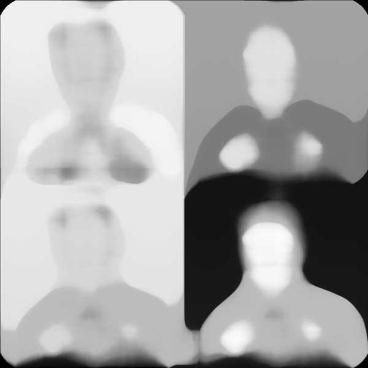
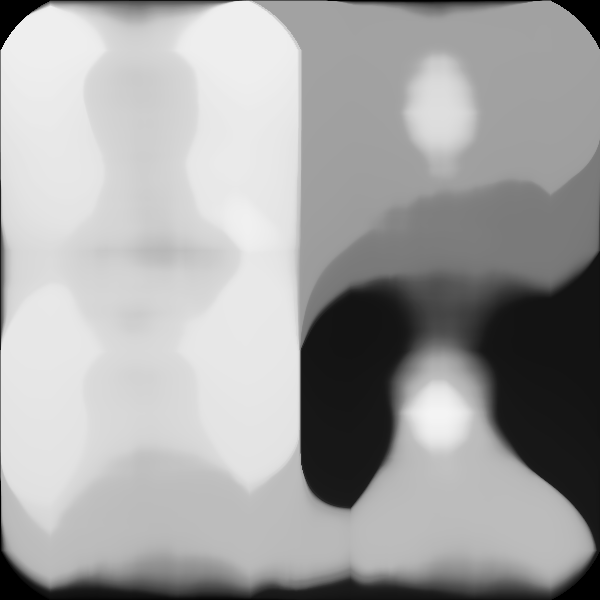

# Lab 1: Попередня обробка зображень
## Variant 4

### Task:
Виконати медіанну фільтрацію зображення з різними значеннями ядра. Провести
порівняльний аналіз

### Results:
- Original image:

- Filter size 1:

- Filter size 2:

- Filter size 5:

- Filter size 10:

- Filter size 20:

- Filter size 50:

- Filter size 100:

